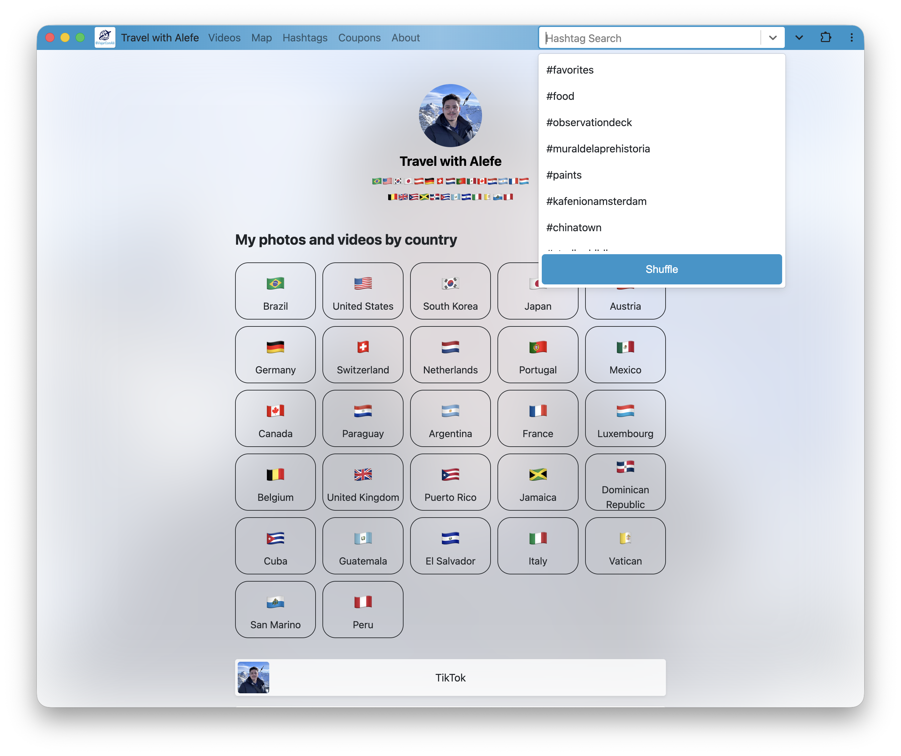
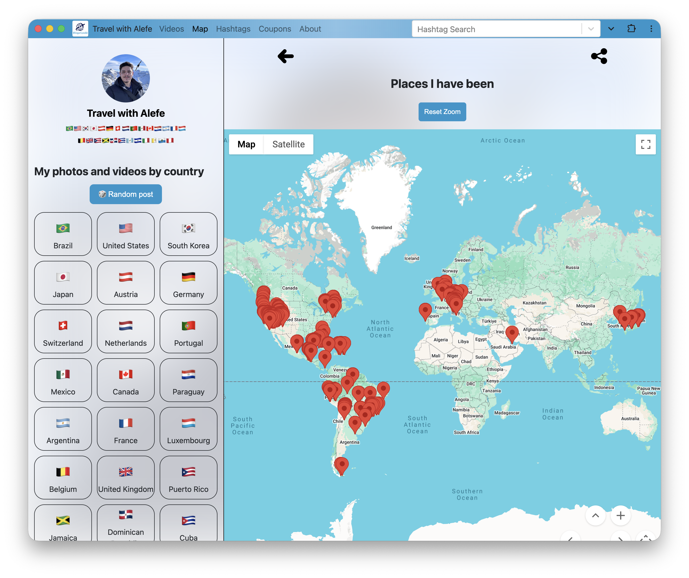

# [travelwithalefe.com](https://travelwithalefe.com)

This repository contains the code for the [Travel with Alefe](https://travelwithalefe.com) website, which intends to be a hub to all my travel social media content, with content separated by country, city, location and hashtag, with pages like a map with every place I went, a hashtag cloud, my discount coupons, a TikTok style random vertical video feed of all my Instagram video stories and a random post button, the template is inspired on link in bio platforms using Google Analytics and PWA concepts like:

- Full `manifest.json`
- Service Worker
- Offline access
- Window Controls Overlay

Also some search engine optimizations like:

- Web Stories
- Structured Data where possible
- Full sitemap with image and video extensions
- Heavy use of local and Firebase App Hosting caching

You can check the indexed content by searching `site:travelwithalefe.com`.

The website is built using Next.js and hosted on Firebase App Hosting with full SSR support using Firestore and Firebase Cloud Storage, the Portuguese version (Viajar com Alê, same project with domain comparison) is hosted on [https://viajarcomale.com.br](https://viajarcomale.com.br).

The website uses Firebase Cloud Firestore as its database. The [./helpers](./helpers/) directory contains helper functions that convert the Instagram archive to JSON with project structure for uploading to Firestore.

The [./functions](./functions/) directory contains Firebase Cloud Functions that help update Cloud Firestore docs when a related doc is created or changed, and some functions that automatically share content to X, Bluesky, and some Fediverse platforms (Mastodon, Pixelfed) periodically. The website also automatically generates RSS feeds for the home page and hashtags, which are useful for automatically sharing content to Pinterest.

